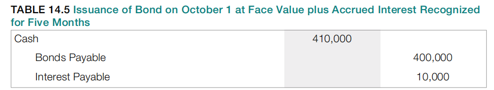
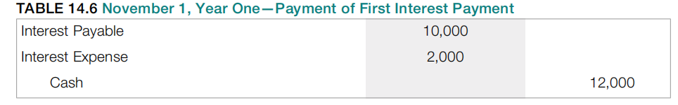

# Ch14

## 14.1 Debt Financing

### 14.1.1 The Cost and Risk of Debt

问题：企业和其他组织需要资金来维持运营和可能的扩张。这些资金数额可能相当大。部分资源通常来自那些通过直接从公司购买股票而成为所有者的投资者。资金也可以通过盈利运营在内部产生。如果每期的净利润超过支付给股东的股息，公司就有了持续的融资来源。

然而，许多公司通过借款获得其大部分运营和发展所需的资金。如果这些债务在下一年内不会支付，它们会在资产负债表中列为非流动负债。例如，JCPenney在2019年2月2日的资产负债表中列示了46亿美元的非流动负债。

债权人期望在指定到期日收回全部贷款余额及利息。资金必须按时到位。因此，承担如此大额的债务使组织面临风险。当负债（特别是大额负债）到期时，实体会面临什么问题和潜在危险？

回答：生活中很少有免费的东西。通过债务为组织融资最明显的问题是它有成本。银行或其他债权人会要求利息作为资金使用的交换。例如，JCPenney报告在截至2019年2月2日的年度中，债务净利息支出约为3.13亿美元。债务利率会根据经济状况和债务人的感知财务健康状况而变化。可以预见的是，强势公司能够以比弱势公司更低的利率借款。

此外，债务带来风险。企业必须能够产生足够的现金盈余来满足债权人的到期债务。JCPenney欠有46亿美元的非流动负债。最终，公司管理层必须找到足够的资金来履行这些义务。这些资金可能来自盈利运营或投资者的投入。或者JCPenney可能简单地尝试借更多的钱来偿还到期债务。这种展期融资很常见，但前提是债务人保持经济实力。无论采取什么方式，公司都必须以能够及时清偿所有债务的方式管理其财务资源。

与债务融资相关的最严重风险是破产的可能性。在最近的经济危机中，不幸的是，无法支付债务的组织可能被迫进入法律破产程序。破产的最终结果通常是公司资产清算，并将这些收益分配给债权人。然而，根据美国法律，财务重组和继续经营也是一种可能。当JCPenney在2020年5月15日申请破产时，公司管理层努力进行重组以避免清算。2021年6月7日，公司在达成一项协议后退出破产，该协议包括将其大部分零售和运营资产出售给Brookfield Asset Management和Simon Property Group，以期保持可行运营。这个决定的结果将在未来几年显现。

考虑到欠有大额债务相关的成本和风险，决策者希望获得充分和清晰信息的愿望是可以理解的。在过去几十年中，很少有财务会计领域像非流动负债的报告这样被广泛讨论。

## 14.2 Issuance of Notes and Bonds

### 14.2.1 Debt Contracts

以下是一些债务工具中的常见术语：

Debenture（信用债券/无担保债券）是一种特定类型的债务工具

### 14.2.2 Recording a Note Issued at Face Value

### 14.2.3 Issuance of Bonds between Interest Dates

问题：债券可以发行给特定的投资者群体或公众。通常，公司会印制债券契约，但要等到公司资金水平较低时才向买家发售。因此，债券经常在两个付息日之间发行。无论债务存续时间长短，都必须按照合同规定向债权人支付利息。如果需要支付利息，债务人在法律上有义务履行。

举例说明，假设Brisbane公司计划向由20位富有个人组成的财团发行面值40万美元的债券。如同前例，这些债券的年利率为6%，每年5月1日和11月1日付息。但是，这笔交易直到第一年10月1日Brisbane需要现金时才完成。

第一次六个月的利息仍然必须按合同约定在11月1日支付。仅仅一个月后，债务人就被迫支付六个月的利息。这并不公平，Brisbane同意这种安排是不明智的。公司如何确保在付息日之间发行债券时对双方都公平？

回答：如问题所述，在付息日之间发行债券是很常见的。因此，需要一个标准系统来使第一次利息支付与债务存续时间相匹配。由于合同条款，Brisbane必须在11月1日支付六个月的利息，尽管现金收益只持有了一个月。在第一次付款中，债权人收到了多出五个月的利息。

因此，这类债券通常以票面金额加应计利息的方式发行。应计利息是从上一个付息日到当前计算的，并向投资者收取。之后，当第一次付款时，净效果仅反映债券已经存续的时间。如果在第一年10月1日发行，债权人（即投资者）应该支付债券面值加五个月的应计利息。之后，当Brisbane在11月1日支付第一次规定的六个月利息时，净效果是一个月的利息——即自发行日起经过的时间（六个月减去五个月）。

假设债权人在第一年10月1日以面值加应计利息购买这些债券。由于自上一个付息日（5月1日）已经过去五个月，截至发行日的债券利息为10,000美元（$400,000 × 6% × 5/12年）。因此，债权人支付400,000美元的债券面值，外加10,000美元的截至当日的应计利息。再次说明，实际记账可以有多种方式，但表14.5中呈现的分录似乎最简单。

一个月之后

在这次分录之后，后续的分录就和在付息日发行的情况一样了（见表14.3和14.4）。

## 14.3 Accounting for Zero-Coupon Bonds

## 14.4 Pricing and Reporting Term Bonds

## 14.5 Issuing and Accounting for Serial Bonds

课件好像到14.4就结束了