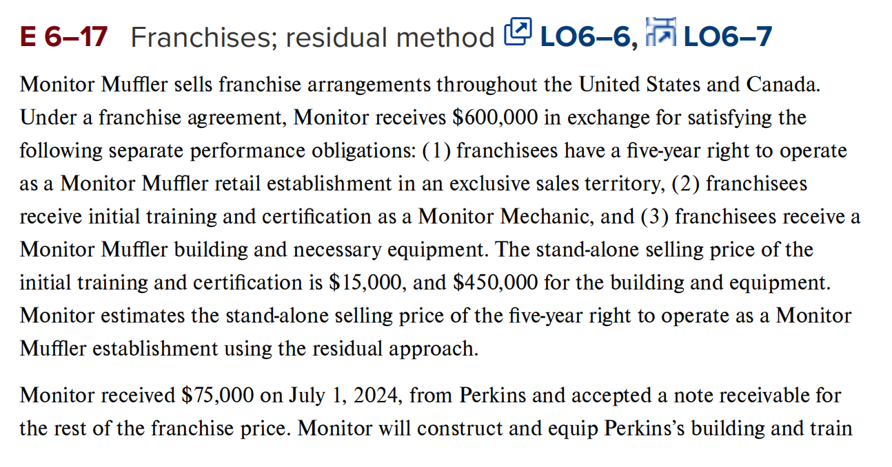

# Part A Introduction to Revenue Recognition

- [x] **LO6–1** State the core revenue recognition principle and the five key steps in applying it.

所有的收入确认都始于卖方和客户之间的合同。你可能没有意识到，但最近你已经参与了几次这样的合同。也许你今天早上在星巴克买了一杯咖啡，或在麦当劳买了一个早餐饼干。又或者你通过亚马逊购买了这本教科书，或在医生诊所做了一次检查。

尽管这些交易并未附带书面和签署的协议，但出于收入确认的目的，它们仍被视为合同。关键在于，你以隐式或显式的方式，达成了一项明确卖方和客户法律权利和义务的安排。

卖方和客户之间的合同包含一个或多个履约义务，这些是卖方向客户转让商品或服务的承诺。**当卖方通过转让承诺的商品或服务来履行==履约义务（performance obligations）==时，就确认收入。**我们认为，当客户获得商品或服务的控制权时，转让即已发生。控制意味着客户可以直接影响商品或服务的使用并获得其收益。

> *履约义务（performance obligations）*是向客户转让商品或服务的承诺。当卖方将商品或服务的控制权转移给客户时，履约义务即被满足。

对于许多合同来说，遵循这种方法是非常直接的。特别是，如果一个合同仅包含一个履约义务，我们通常只需要确定卖方何时向客户交付商品或提供服务，然后确保卖方在那个时间确认收入。

E.g. 假设梅西百货以75美元向索菲亚出售一件之前以40美元从批发商购买的夹克。梅西百货将如何核算这笔销售？

1. 识别与客户的合同：在这种情况下，合同可能不是书面的，但很清晰——梅西百货向索菲亚交付夹克，索菲亚同意向梅西百货支付75美元。

2. 识别合同中的履约义务：梅西百货只有一个履约义务——交付夹克。

3. 确定交易价格：梅西百货有权从索菲亚处收取75美元。

4. 将交易价格分配给各履约义务：由于只有一个履约义务，梅西百货将全部75美元的交易价格分配给夹克的交付。

5. 在（或随着）每个履约义务得到满足时确认收入：当梅西百货向索菲亚交付夹克时，其履约义务即告完成，此时梅西百货记录以下会计分录：

当合同包含多个履约义务时，收入确认就变得更加复杂。例如，当Verizon（威瑞森）为新的手机客户签约时，销售合同可能要求Verizon提供：(1) 智能手机，(2) 相关软件，(3) 手机保修，(4) 持续的网络接入，以及 (5) 可选的未来升级。Verizon必须确定这些商品和服务中哪些构成履约义务，将交易价格分配给这些履约义务，并在每个履约义务得到满足时（或随着履约义务的满足）确认收入。

在本章的Part A，我们将把确认收入的五个步骤应用于各种类型的合同。首先，我们将聚焦于仅有一个在单一时点交付商品或服务的履约义务的合同，就像梅西百货向索菲亚销售夹克的情况。然后，我们将考虑在一段时间内满足交付商品和服务的履约义务的情况，比如房东出租公寓或银行放贷。之后，我们将研究包含多个履约义务的合同，就像我们刚刚讨论的Verizon示例。图示6-2总结了我们将在本章中反复探讨的一些关键考虑因素。

## 在一个时点上确认收入

- [x] **LO6–2** Explain when it is appropriate to recognize revenue at a single point in time.

首先，我们考虑一个仅包含单一履约义务并在单一时点完成的简单合同。当商品或服务的控制权从卖方转移到客户时，履约义务即告完成。通常，在交付时间可以清楚地确定转移已发生。在我们之前的梅西百货示例中，当夹克转移给索菲亚时，履约义务在销售时即告完成。

在其他情况下，控制权的转移可能更难确定。图示6-3列出了我们用来判断控制权是否已从卖方转移到客户的五个关键指标。卖方应单独和综合评估这些指标，以决定控制权是否已转移，从而确认收入。

在图示6-4中，我们将这些指标应用于TrueTech Industries公司，这是我们将在本章全程用来说明收入确认的公司。

**Illustration 6–4** Recognizing Revenue at a Point in Time

TrueTech Industries销售Tri-Box，这是一款游戏机，允许用户在互联网上单独或多人游戏。Tri-Box只是一个游戏模块，不包含其他商品或服务。TrueTech应在向CompStores销售1,000台Tri-Box时何时确认收入？

2023年12月20日：CompStores订购1,000台Tri-Box，每台价格240美元，承诺在交付后30天内付款。TrueTech已收到订单，但尚未履行交付Tri-Box的履约义务。基于此和其他指标，TrueTech判断控制权尚未转移，不应确认收入。

2024年1月1日：TrueTech向CompStores交付1,000台Tri-Box，Tri-Box的所有权转移给CompStores。TrueTech已交付Tri-Box，CompStores已接受交付，因此CompStores拥有实物占有、法律所有权、所有权的风险和报酬以及向TrueTech支付的义务。TrueTech的履约义务已完成，因此TrueTech可以确认收入和相关的24万美元应收账款。*

2024年1月25日：TrueTech收到CompStores支付的240,000美元。这笔交易不影响收入。我们在履约义务完成时确认收入，而非收到现金时。TrueTech仅简单记录收回应收账款。

## 在一个时间段内确认收入

- [x] **LO6–3** Explain when it is appropriate to recognize revenue over a period of time.

诸如放贷、执行审计和提供咨询建议等服务是在一段时间内执行的。某些建筑合同需要数月甚至数年的施工。在这些情况下，公司应该在产品或服务提供期间持续确认收入，还是等到公司完全提供产品或服务的单一时点再确认收入？正如我们接下来将看到的，在大多数这类情况下，公司应在服务或产品提供过程中逐步确认收入。

### 按时间确认收入的标准

再次假设我们有一个与客户的合同，其中包含单一履约义务和已知的交易价格。如图示6-5所示，如果满足以下三个标准中的任何一个，我们将按时间确认收入。

> （翻译）如果满足以下任一标准，我们将按时间确认收入：
>
> 1. 客户在服务执行过程中消费卖方工作的收益，例如公司在一段时间内为客户提供清洁服务，或
> 2. 客户在资产创建过程中控制该资产，例如承包商在客户现有建筑上建造扩建部分，或
> 3. 卖方正在创建一个对卖方没有替代用途的资产，且卖方有权就已完成的进度收取款项，例如公司为美国空军定制战斗机。

如果履约义务满足至少一个标准，我们将按比例在一段时间内确认收入，该比例与已完成的履约义务金额成正比。例如，如果一项服务已完成三分之一，那么履约义务也已完成三分之一，因此应确认三分之一的收入。例如，Planet Fitness（行星健身）在预期的会员期限内确认注册费收入，Six Flags Entertainment（六旗娱乐）根据会员流量在运营季节内确认季票收入。

> 当履约义务在一段时间内完成时，收入按已完成履约义务的比例确认。

这些安排通常涉及在履约义务完成之前预先收取现金，这要求确认一项负债——递延收入。例如，请参考图示6-6：

**Illustration 6–6** Recognizing Revenue over a Period of Time

TrueTech Industries销售一年期的Tri-Net多用户互联网游戏平台订阅。TrueTech在2024年1月1日销售了1,000份订阅，每份60美元。

TrueTech有单一履约义务——通过允许订阅者在一年内访问游戏平台来向订阅者提供服务。因为Tri-Net用户在整个服务期间持续消费访问服务的收益，根据图示6-5中的第一个标准，TrueTech将在一年的时间内确认订阅收入。

在2024年1月1日，TrueTech记录以下日记账分录：

TrueTech在1月1日不确认收入。相反，TrueTech确认了6万美元的递延收入负债，这与在履行为客户提供一年Tri-Net游戏访问的履约义务之前收到现金有关。

Tri-Net订阅者在每天访问Tri-Net网络时都能获得收益，因此TrueTech使用"时间比例"作为完成进度的衡量标准。在销售后的12个月中的每个月末，TrueTech将记录以下分录以确认Tri-Net订阅收入：

12个月后，TrueTech将已确认全部60,000美元的Tri-Net订阅收入，并且递延收入负债将减少至零。

大多数长期建筑合同都符合按时间确认收入的条件。例如，许多长期建筑合同的结构是这样的，客户在施工过程中拥有在制品（WIP），这满足了图示6-5中的第二个标准。此外，如果卖方正在建造的资产对卖方没有替代用途，且合同规定卖方按履约获得报酬，则满足第三个标准。我们将在本章的C部分更详细地讨论长期建筑合同的会计处理。

如果履约义务不符合按时间确认收入的三个标准中的任何一个，我们将在履约义务完全满足的时点确认收入，这通常发生在合同结束时。

许多服务本质上是短期的，即使符合按时间确认收入的条件，公司也不会费心这样做。例如，房屋粉刷服务在工作执行过程中为客户提供利益，因此满足按时间确认收入的第一个标准。然而，在粉刷任务结束时一次性确认收入可能更简单。鉴于粉刷服务的短期性质和更精确的收入确认时间不会提供额外有用信息，这种偏离GAAP的做法是不重要的。

### 确定完成进度

由于完成进度是按时间确认收入的基础，卖方需要以反映商品或服务控制权转移的方式估算这一进度。

卖方有时使用基于产出的（*output-based*）完成进度估算，以已转移的商品或服务的比例来衡量。在我们的Tri-Net示例（图示6-6）中，产出是通过时间流逝来衡量的，因为正在履行的义务是提供Tri-Net游戏平台的访问。

有时卖方使用基于投入的（*input-based*）完成进度估算，以迄今为止已投入的努力与预期满足履约义务的总努力的比例来衡量。例如，卖方经常使用已发生成本与预计完成工作的总成本的比率。在本章的Part C，我们将继续讨论基于产出和投入的完成进度衡量方法，并考虑如何处理完成进度估算的变更。

## 为包含多项履约义务的合同确认收入

- [x] **LO6–4** Allocate a contract’s transaction price to multiple performance obligations.

同一份合同可能包含需要在不同时间确认的多个履约义务。例如，考虑Peloton Interactive, Inc.提供的安排。销售Peloton自行车可能与预付的12个月Peloton直播和点播健身课程库的订阅捆绑在一起。自行车的收入应在交付时确认，而订阅的收入应在订阅期限内确认。如何在这两个履约义务之间分配捆绑销售的单一价格？要回答这个问题，请参考图示6-7，我们在其中结合了已经讨论过的两个TrueTech示例。在第一个示例（图示6-4）中，TrueTech销售Tri-Box模块并在单一时点（交付时）确认收入。在第二个示例（图示6-6）中，TrueTech销售Tri-Net平台的一年订阅，并按时间确认收入（在一年内每月确认十二分之一）。现在，让我们考虑如果这两个项目作为一个包的单一价格出售，TrueTech将如何确认收入。

| 图示6-7 包含多个履约义务的合同                               |
| ------------------------------------------------------------ |
| TrueTech Industries制造Tri-Box系统，这是一个允许玩家通过互联网相互竞争的多人游戏系统。 Tri-Box系统包括物理Tri-Box模块以及一年的Tri-Net多用户互联网游戏和其他应用平台订阅。TrueTech单独销售Tri-Net平台的一年订阅，价格为60美元。客户可以使用Tri-Box或者其他游戏模块访问Tri-Net。TrueTech单独销售Tri-Box模块，价格为240美元。客户可以使用Tri-Box或者其他多用户游戏平台访问Tri-Net。两个放在一起进行捆绑销售，TrueTech销售Tri-Box系统（模块加订阅）的价格为250美元。 2024年1月1日，TrueTech向CompStores交付1,000个Tri-Box系统，每个系统价格为250美元。TrueTech于2024年1月25日从CompStores收到250,000美元。 |

我们假设TrueTech已确定与CompStores有合同，因此收入确认的第1步已满足。我们将从第2步开始。

### 第2步：识别履约义务

卖方在商品或服务与合同中的其他商品或服务==独立（distinct）==时，将提供商品或服务的承诺作为履约义务进行会计处理。其思路是将合同分解为可以独立看待的部分。这样，财务报表可以更好地反映单独商品和服务转移的时间以及各自产生的利润。不独立的商品或服务则被组合起来，作为单一履约义务处理。

商品或服务如果同时满足以下两个条件（两个都得满足，很多情况下是只满足第一个不满足第二个），则是独立的：

1. 能够独立存在（Capable of being distinct）。客户可以单独使用该商品或服务，或者与其他可在其他地方获得的商品或服务组合使用。
2. 在合同中可与其他商品或服务区分（Separately identifiable）。在合同的背景下，转让商品和服务的承诺是不同的，因为卖方承诺单独提供商品和服务，而不是承诺提供一个复合的商品或服务，其中各个商品或服务仅作为输入。

以应用这些标准为例，想象去像家得宝（The Home Depot）这样的商店购买木材、油漆和其他建筑用品来进行家庭项目。这些产品中的每一种都能够独立存在，因为你可以单独购买并按自己的意愿使用。每种产品也可以与其他商品和服务区分开来，因为家得宝的唯一履约义务是交付各个独立的物品。所以，家得宝可以将交付这些每个项目的承诺视为单独的履约义务。

现在想象与像Toll Brothers这样的建筑承包商签订一份为你建造房屋的合同。与家得宝类似，承包商也是向你销售木材、油漆和其他建筑用品。然而，尽管这些项目能够独立存在，但在合同背景下它们并不是可区分的，因为承包商的履约义务是将这些输入项组合并交付一个完成的建筑物。因此，Toll Brothers将自身视为只有在房屋交付并将所有权转移给买家时才履行的单一履约义务。正如我们将在本章C部分进一步讨论的，大多数长期建筑合同被视为包含单一履约义务，因为卖方提供将商品和服务组合成一个综合输出的服务。

建筑合同并非唯一未通过"可独立识别"标准的合同。如果商品和服务高度相互依赖，或者一个显著地修改或定制另一个，则它们也不被视为可区分的。例如，考虑一家提供在线访问剪贴画库的公司。客户只能通过在线访问服务来访问剪贴画。尽管剪贴画库和在线访问服务在合同之外可能是可以独立存在的，但在合同内，它们是如此紧密交织，以至于更恰当地被视为单一履约义务。

在图示6-8中，我们将应用这些标准来识别我们的TrueTech示例中的履约义务。

| 图示6-8 确定商品或服务是否独立                               |
| ------------------------------------------------------------ |
| 假设与图示6-7中相同的事实。Tri-Box模块和Tri-Net订阅是否符合TrueTech与CompStores合同中的履约义务？ 合同中的哪些商品和服务是独立的？Tri-Box模块和Tri-Net订阅都可以由客户单独使用，因此它们能够独立存在。该模块和订阅并非高度相互关联，也不会相互修改或定制，并且TrueTech的承诺性质不是将模块和服务整合为一个综合单元，因此在合同背景下它们是可独立识别的。 结论：该模块和订阅是独立的，因此该合同有两个履约义务：(1)交付Tri-Box模块和 (2)履行一年的Tri-Net订阅。 |

### 第3步：确定交易价格

交易价格（transaction price）是卖方预期从客户获得的、用于提供商品或服务的对价金额。如果客户在销售时或销售后不久支付固定金额，确定交易价格就很简单。这就是我们的TrueTech示例中的情况。交易价格为250,000美元，等于每个系统250美元 × 1,000个系统。

### 第4步：将交易价格分配到每个履约义务

如果合同包含多个履约义务，卖方应按照合同中所有履约义务的相关商品或服务的独立销售价格的比例来分配交易价格。独立销售价格是在类似情况下单独销售该商品或服务的金额。如果无法直接观察到独立销售价格，卖方应当对其进行估计。

请查看图示6-9，了解我们如何在TrueTech示例中将交易价格分配到各个履约义务。

### 第5步：在每个履约义务得到满足时（或随着履约义务的满足）确认收入

正如我们之前讨论过的，履约义务可以在某一时点或在一段时间内得到满足，与履约义务相关的收入在履约义务得到满足时（或随着履约义务的满足）确认。我们单独确定每个履约义务的收入确认时间。

| 补充考虑                                                     |
| ------------------------------------------------------------ |
| 具有多个履约义务的合同中的折扣。请注意，图示6-9显示Tri-Box系统是以折扣销售的——TrueTech以交易价格（250美元）销售系统，低于Tri-Box模块（240美元）和Tri-Net订阅（60美元）独立销售价格的总和300美元。由于没有证据表明折扣仅与某一履约义务相关，因此折扣将在它们之间进行分摊。如果TrueTech有明确的销售证据表明折扣仅与其中一个相关，则全部的折扣将分配给该商品或服务。 |

回到我们的Tri-Box系统示例，与Tri-Box模块相关的200,000美元收入在1月1日向CompStores交付这些模块时确认，而与Tri-Net订阅相关的50,000美元收入则在整个一年的订阅期内确认。每个履约义务的收入确认时间如图示6-10所示。

将图示6-10中的日记账分录与图示6-4和6-6中的分录进行比较是很有趣的。因为250,000美元交易价格中有200,000美元分配给Tri-Box模块，所以交付时确认的收入比单独销售240,000美元时确认的收入要少。同样，因为250,000美元交易价格中有50,000美元分配给Tri-Net订阅，所以每月确认的订阅收入（每月4,167美元）比单独销售60,000美元时（每月5,000美元）要少。换句话说，Tri-Box模块和Tri-Net订阅确认的较低收入反映了捆绑销售项目的折扣分配。

图示6-11总结了Part A关于收入确认的基本问题的讨论。

# PART B Special Issues in Revenue Recognition

# PART C Accounting for Long-Term Contracts

- [x] 学习目标6-9：演示长期合同的收入确认，包括在合同完成时的某一时点确认和按完工进度在一段时间内确认。

对500家大型上市公司报告实践的一项调查显示，大约每八家公司中就有一家参与长期合同。这些不仅仅是建筑公司。图示6-26列出了使用长期合同的公司的一个简单样本，其中许多公司你可能很熟悉。

本章A和B部分描述的五步收入确认过程同样适用于长期合同。然而，第2步和第5步值得特别关注。

第2步，"识别合同中的履约义务"，很重要，因为长期合同通常包含许多可能被视为单独履约义务的产品和服务。例如，建造一座建筑需要建造商提供许多不同的材料和其他产品（混凝土、木材、炉子、卫生间固定装置、地毯）和提供许多不同的服务（测量、挖掘、施工、固定装置安装、粉刷、景观设计）。这些产品和服务是能够独立存在的，但并不能区分开来，因为卖方的角色是将这些产品和服务组合起来，目的是向客户交付一座完整的建筑。因此，这些产品和服务的组合构成了单一的履约义务。大多数长期合同应被视为包含单一履约义务。

第5步，"在每个履约义务得到满足时（或随着履约义务的满足）确认收入"，很重要，因为对于长期合同，在一段时间内确认收入和仅在合同完成时确认收入之间可能存在相当大的差异。想象一个建筑商花费数年时间建造一座摩天大楼，但只能在合同结束时确认收入。这种延迟的收入确认将无法很好地向财务报表使用者反映建筑商的经济活动。幸运的是，大多数长期合同都符合在一段时间内确认收入的条件。通常，客户拥有卖方的在制品，使得卖方正在创建一项随完成进度由客户控制的资产。另一种情况是，卖方经常为客户定制一项资产，因此卖方对该资产没有其他用途，并且即使客户取消合同，也有权获得已完成进度的报酬。在这两种情况下，卖方都在一段时间内确认收入。

长期合同是复杂的，已经开发出专门的会计处理方法来处理这种复杂性。接下来我们将演示用于在一段时间内和某一时点确认长期合同收入所需的日记账分录。

## Accounting for a Profitable Long-Term Contract

无论是在合同期间还是在合同完成时确认收入，长期合同的大部分会计处理是相同的。因此，我们首先讨论两种方法的相似之处，然后再讨论不同之处。你会发现，无论采用哪种方式，我们在合同生命周期内确认的总收入和利润是相同的。只有确认的时间不同。

图示6-27提供了一个典型的长期建筑合同信息，我们将用它来考虑长期合同的会计处理。

图示6-27 长期建筑合同示例
2024年初，哈丁建筑公司接到一份建造办公楼的合同，合同金额为500万美元。哈丁将按照买方提供的规格建造建筑物，预计项目需要三年完成。根据合同，哈丁将按照预先安排的进度，分期向买方开具账单。与合同相关的信息如下：

建筑成本包括直接与建筑物施工相关的人工、材料和间接费用。请注意估计的和实际的建筑成本总额是如何从一个期间变化到另一个期间的。成本修订在长期合同中是典型的，因为成本是在长期间隔内估算的。

### 建筑成本和应收账款的会计处理

图示6-27A显示了实际建筑成本、开具账单和现金收款的汇总日记账分录。这些日记账分录不受收入确认时间的影响。

第一个日记账分录显示哈丁在施工过程中发生各种成本，并将其记录在名为==在建工程（construction in progress，简称CIP）==的资产账户中。这个资产账户相当于制造公司中的在制品库存。这是合乎逻辑的，因为对于承包商来说，建筑项目本质上是一个正在进行中的存货项目。即借记Construction in progress (+A)，贷记Cash, materials, etc (-A)，资产总额不变。

第二个日记账分录发生在哈丁按照合同允许的任何进度向客户开具账单（即让客户付钱）时。请注意，定期开具的账单会贷记=="建筑合同开票（billings on construction contract）"==账户（-A）。这个账户是在建工程（CIP）资产的抵销科目。**在每个期末，这两个账户的余额会被比较。如果净金额是借方余额，它将在资产负债表中报告为合同资产，可能命名为"建设进度超过开票"或类似名称。相反，如果净金额是贷方余额，它将被报告为合同负债，可能命名为"开票超过建设进度"或类似名称。（这两个账户只会在资产负债表中出现，见后文的图示6-27F）**

要理解为什么使用"建筑合同开票"账户（简称开票），需要考虑长期合同会计处理与普通存货销售会计处理之间的关键区别。在正常情况下，卖方借记应收账款并贷记收入，同时借记销售成本并贷记存货。因此，卖方在获得财务资产（应收账款）并确认收入的同时放弃了实物资产（存货）。刚开始实物资产在资产负债表中，然后变成财务资产，但这两者不会同时存在于资产负债表中。

现在考虑哈丁建筑的例子。哈丁在同一时期创建实物资产（CIP），同时确认财务资产（首先在开具账单时确认应收账款，然后在收到款项时确认现金）。同时在资产负债表中拥有实物资产和财务资产会导致对同一安排的重复计算。"开票"账户解决了这个问题。每当确认应收账款时，日记账分录的另一边会增加开票账户，这与CIP相抵（从而减少）。结果是，财务资产（应收账款）增加，实物资产（CIP减去开票得到的净额）减少，避免了重复计算。

**请记住，我们在卖方拥有无条件收款权时确认应收账款（即仅需时间流逝即可到期的情况），而在收款权取决于时间流逝以外的其他因素时确认合同资产。**与这些定义一致，哈丁将为已开具账单但尚未收到的金额报告应收账款，并为已完成但尚未能开具账单的剩余工作量报告合同资产（通过CIP减去开票计算）。

### 收入确认的一般方法

现在让我们来考虑收入确认。图示6-27B的上半部分显示了在合同完成时确认收入的单一日记账分录，包括确认收入、建筑成本（可以将其视为销货成本，cost of goods sold）和毛利（记在 Construction in progress 账户下）；而下半部分显示了在合同期间确认收入时的日记账分录。此时，请专注于日记账分录的结构（借方和贷方科目）。我们将在本章后面讨论如何计算具体金额（每年确认的收入金额是怎么算出来的见后文）。

理解图示6-27B的两个关键方面非常重要。首先，无论是在合同期限内还是仅在完工时，确认的收入（500万美元合同价格）、成本和毛利金额是相同的。唯一的区别在于时间。为了验证这一点，我们可以将这两种方法在三年内确认的所有收入加总，具体如下：

**其次，请注意，无论收入确认的时间如何，我们都将毛利（收入和成本之间的差额）添加到在建工程（CIP）资产中。**这看起来很奇怪——为什么要将利润添加到本质上是一种存货账户的资产中？关键在于，当哈丁确认毛利时，哈丁就像是已经向客户出售了一部分的资产，但哈丁仍将资产保留在自己的资产负债表中（在CIP账户中），直到最终交付给客户。将确认的毛利计入CIP账户只是更新该账户，以反映客户资产的总价值（成本4,100,000 + 毛利 900,000= 销售价格5,000,000）。但不要忘记，开票账户是CIP账户的对方科目。在建设项目的整个生命周期中，哈丁将向客户开具资产全部销售价格的账单（1,200,000+2,000,000+1,800,000=5,000,000，见图示6-27）。因此，在合同结束时，CIP账户（包含总成本4,100,000，见图示6-27A确认成本时，和毛利900,000，见图示6-27B确认收入时）和开票账户（向客户开具的所有金额1,200,000+2,000,000+1,800,000=5,000,000）将具有相等的余额，这些余额完全抵消，最终净值为零。

现在让我们更详细地讨论收入确认的时间。

### 方法1：合同完成时一次性确认收入

如果合同不符合在一段时间内确认收入的条件，收入将在控制权从卖方转移到客户的时点确认，这通常发生在合同完成时。届时，卖方将自身视为出售资产，并确认与销售相关的收入和费用。如图示6-27B和下面的T型账户所示，在我们的哈丁示例中，完工发生在2026年。在此之前，在建工程（CIP）仅包含成本，2024年末累计余额为1,500,000美元，2025年末为2,500,000美元，当项目在2026年完工时，总计4,100,000美元（1,500,000 + 1,000,000 + 1,600,000）。完工时，哈丁确认收入5,000,000美元和建筑成本（类似销售成本）4,100,000美元，因为资产在该日期被视为"已售"。哈丁将900,000美元毛利计入CIP（借记CIP），使其余额增加到项目的总成本加毛利5,000,000美元。

### 方法2：按完工进度确认收入

如果合同符合在一段时间内确认收入的条件，收入将基于完工进度确认。应如何估算迄今的进度？

正如本章A部分所讨论的，估算完工进度的一种方法是使用**基于产出**的衡量标准，如生产或交付的单位数量、里程碑的到达、以及对迄今已完成绩效的调查或评估。产出衡量的一个缺陷是可能提供对实际进度的扭曲视图。例如，公路建设的产出衡量可能是已完成的道路里程，但如果并非所有道路里程都需要相同的工作量，这种衡量可能会产生误导。亚利桑那州的公路合同可能会为穿越山区的道路里程向承包商支付更多费用，而不是横穿平坦沙漠的道路里程。某些产出衡量的另一个缺陷是，它们所需的信息（如调查或评估）可能获取成本较高。

估算进度的另一种方法是**基于卖方的投入**，以迄今为止为满足履约义务而已付出的努力与预期总努力的比例来衡量。努力的衡量包括已发生成本、已用labor hours、使用的机器小时数或经过的时间。==估算完工进度最常用的方法是使用"成本对成本比率"，比较迄今已发生的总成本与完成项目的预计总成本。==使用这种方法时，卖方必须确保从比率中排除不反映完工进度的成本。例如，生产中的低效可能导致材料、人力或其他资源的浪费。虽然这些成本必须在发生时计入费用，但它们不应包含在成本对成本比率中。

无论使用何种具体方法估算完工进度，我们都使用以下逻辑来确定每个期间确认的收入金额：

==本期确认的收入=预计总收入*当前完工进度（即迄今应确认的累计收入金额）-前期确认的所有收入==

图示6-27C展示了哈丁建筑公司示例中每年收入的计算，使用成本对成本比率估算迄今的进度。请注意，这种方法通过首先计算迄今应确认的累计收入金额，然后减去之前期间已确认的收入以确定当期确认的收入，自动包含了<u>剩余工作的估计成本</u>的变动，因此也包含了<u>估计的完工百分比</u>的变动。参考下面的T型账户，可以看到每期确认的毛利被添加到在建工程（CIP）账户中。

如果合同符合在一段时间内确认收入的条件，每年的利润表都将报告相应的收入和建筑成本金额。例如，在2024年，利润表将报告收入2,000,000美元（合同价格5,000,000美元的40%），减去1,500,000美元的建筑成本，从而产生500,000美元的毛利。图示6-27D中的表格显示了我们示例中三年中每年确认的收入、建筑成本和毛利。

### 合同完成

在工作完成后，哈丁剩下的唯一任务是正式将完工资产的所有权转移给客户。届时，哈丁将准备一个日记账分录，通过借记billings on construction contract账户并贷记 CIP 账户，将合同从其资产负债表中移除，金额为合同全部价值。如图示6-27E所示，无论收入是在合同期限内还是在合同完成时确认，用于结清billings on construction contract账户和CIP账户的日记账分录都是相同的。

## 对比：一次性确认收入vs按完工进度确认收入

### 收入确认

图示6-27B展示了在合同期限内和合同完成时确认收入时，将在利润表中呈现的收入、成本和毛利金额的日记账分录。通过比较每种收入确认方法产生的毛利模式，可以揭示它们之间的本质区别：

无论收入是随时间确认还是在完工时确认，在这三年合同期内确认的总毛利90万美元不会受到影响，但毛利确认的时间会受到影响。当合同不符合随时间确认收入的条件时，我们将所有毛利递延至2026年，即项目完工时。显然，在合同期限内确认收入能够更好地衡量公司在这三年期间的经济活动和进展。如前所述，大多数长期合同都符合随时间确认收入的条件。只有在卖方不符合图示6-5中列出的随时间确认收入的标准时，收入才会递延至合同完成时。

### 资产负债表确认

图示6-27F展示了两种方法下与建造相关的账户在资产负债表中的列示。<!--（两种方法中每期billings都是一样的，区别在于每期CIP不一样，对于在项目完成时一次性确认收入，其CIP账户只包含成本，比如2024年CIP账户的余额是1,500,000；而对于按时间逐步确认收入，其CIP账户包含成本和毛利，如2024年CIP账户的余额是2,000,000=1,500,000+500,000）-->

在资产负债表中，在建工程（CIP）账户与建造合同开票账户相互抵消，当CIP > 开票时，被视为合同资产并标记为"CIP超过开票"；当开票 > CIP时，被视为合同负债并标记为"开票超过CIP"。公司有时不直接使用CIP，而是引用CIP账户所包含的内容。当在合同期限内逐步确认收入时，CIP包含成本和毛利；如果在合同完成时一次性确认收入，CIP通常仅包含成本<!--（项目期间不确认毛利，CIP账户仅累积成本，项目完工时一次性确认全部毛利）-->。由于一家公司可能有些合同处于净资产头寸，而其他合同处于净负债头寸，在同一资产负债表中同时显示合同资产和合同负债并不罕见。

当CIP超过开票时，将其作为合同资产而非应收账款处理，因为除了时间推移外，还必须发生其他事项公司才能获得该金额的付款。尽管哈丁已发生建造成本（并在合同期限内确认毛利），买方将支付这些款项，但根据建造合同，这些金额尚不可开票。一旦哈丁取得足够的进展可以向客户开票，它将借记应收账款并贷记开票，这将增加应收账款资产并减少“CIP超过开票”（通过增加开票）。

另一方面，开票超过CIP被视为合同负债。这反映了哈丁为已完成工作以外的工作向客户开票。这类似于当客户预先支付产品或服务时记录的递延收入负债。预收款适当地显示为一项负债，代表未来提供商品或服务的义务。

## 长期合同亏损

上述哈丁建筑公司的示例涉及在合同每个阶段都预期获得整体利润的情况。不幸的是，长期合同有时会发生亏损。随着事实的变化，卖方必须更新其估计并在必要时确认亏损，以正确核算至今应确认的收入金额。我们在任何一期对亏损的处理取决于合同是否总体上是盈利的。

### 情形1：具有盈利性项目的阶段性亏损

当一个项目符合随时间确认收入的条件时，尽管项目作为整体预期是盈利的，但有时必须在过程中至少确认一期亏损。我们确定亏损的方式与确定盈利年份的利润的方式完全相同。例如，假设依然使用图示6-27中描述的500万美元合同，但具有以下成本信息：

在2024年末，项目完成40%（1,500,000 ÷ 3,750,000）。如前所述，确认收入2,000,000美元 - 建造成本1,500,000美元 = 毛利500,000美元。

然而在2025年末，公司现在预测该项目的总利润为400,000美元（等于5,000,000 - 4,600,000），并且此时项目估计完成60%（2,760,000 ÷ 4,600,000）。将这一百分比应用于预期收入5,000,000美元，得出至今收入为3,000,000美元。这意味着至今应确认的毛利应为240,000美元（等于3,000,000 - 2,760,000）。但请记住，上一年已确认毛利500,000美元。

我们将这种情况视为会计估计变更，因为它源于2024年末对完工成本估计的变化。2025年末完成项目的总估计成本4,600,000美元，远高于2024年年末的估计3,750,000美元。回想第4章关于会计估计变更的讨论，我们不会追溯重述前一年的利润表。**相反，2025年利润表报告亏损260,000美元（计算方法为500,000 - 240,000），以使至今累计确认的毛利为240,000美元。**该亏损包括2025年收入1,000,000美元（计算方法为5,000,000 × 60% = 2025年末应确认收入3,000,000美元减去2024年收入2,000,000美元）减去建造成本1,260,000美元（2025年发生的成本）。就像毛利记入在建工程（CIP）账户一样，**这笔毛损也贷记入CIP账户**，以使CIP包含至今确认的累计毛利或亏损。以下日记账分录记录2025年的亏损：

在2026年，公司确认收入2,000,000美元（等于5,000,000美元减去2024年和2025年已确认的3,000,000美元），确认建造成本1,840,000美元（2026年发生的成本），产生毛利160,000美元。

当然，如果收入是在合同完成时而非随时间确认，那么2024年和2025年不会记录任何利润或亏损。相反，收入5,000,000美元、建造成本4,600,000美元以及毛利400,000美元将在2026年确认。

### 情形2：整个项目预计亏损

如果整个合同预计将发生总体亏损，则必须在亏损变得明显的当期确认全部亏损，无论收入是在合同期限内确认还是仅在合同完成时确认。再次以哈丁建筑公司的示例为例，但使用以下成本信息：

在2025年末，修订后的成本显示整个项目预计亏损100,000美元（计算方法为合同收入5,000,000美元减去估计建造成本5,100,000美元）。**在这种情况下，无论收入是在合同期限内确认还是仅在合同完成时确认，都必须在2025年确认全部预计亏损。**如果收入是在合同期限内确认，2024年已确认500,000美元的毛利，因此2025年确认600,000美元的亏损，使得至今累计确认的金额总计为100,000美元的亏损。再次强调，这种情况被视为会计估计变更，不重述2024年收入。另一方面，如果收入仅在合同完成时确认，2024年不确认任何毛利，项目的100,000美元亏损在2025年确认。这是通过借记长期合同亏损并贷记在建工程（CIP）100,000美元来实现的。

为什么在2025年确认预计总亏损100,000美元，而不是在合同结束时？如果不在2025年确认亏损，在建工程（CIP）将被记录为高于公司预期从合同中实现的金额。为避免这个问题，亏损将CIP账户减记至2,660,000美元（计算方法为迄今成本2,760,000美元减去预计总亏损100,000美元）。这个金额加上预计完工成本2,340,000美元，等于合同价格5,000,000美元。**在损失已知的期间确认长期合同亏损，类似于以“成本与可变现净值孰低法”计量存货，这是我们将在第9章研究的概念。**

损益模式在合同期限内概括如下表。请注意，2026年额外的未预料到的成本增加100,000美元导致再次确认100,000美元的亏损。

图示6-27G的表格显示了假设合同符合按进度确认收入的情况下，在这三年中每年确认的收入和建造成本。收入通过将完工百分比乘以总合同价格的方式通常进行确认。**在预期整个项目将发生亏损的情况下，当期的建造成本将不再等于当期发生的成本。计算建造成本的最简单方法是将确认的亏损金额加上确认的收入金额。**例如，在2025年，确认的收入706,000美元加上600,000美元的亏损，得出建造成本为1,306,000美元。

记录2025年和2026年损失的会计分录如下：

在这种情况下，按进度确认收入会导致2024年收入大幅高估，并因未来成本估计变更而在2025年大幅低估。当按进度确认收入时，这种估计修正偶尔会发生。

**当合同不符合按进度确认收入的条件时，在合同完成之前不确认任何收入或建造成本。**在2025年，确认长期合同亏损（损益类账户，暂时性的）100,000美元。在2026年，损益表将报告收入5,000,000美元和建造成本5,100,000美元，合计额外亏损100,000美元。记录2025年和2026年损失的会计分录如下：

# Exercise

# Problem

