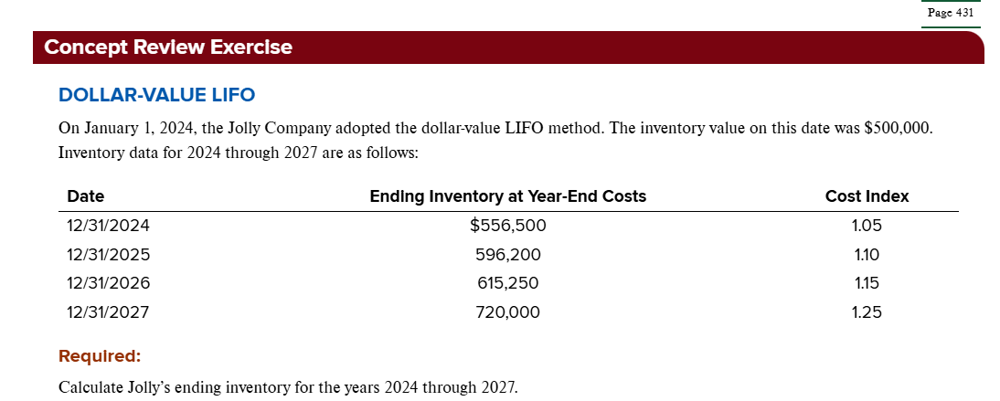
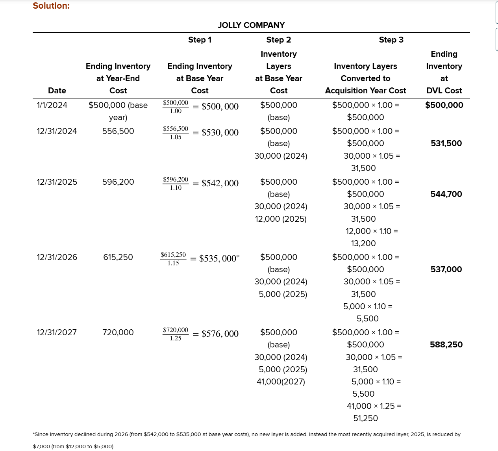

# PART A Recording and Measuring Inventory

## Types of Inventory

## Types of Inventory Systems

## What Is Included in Inventory?

## Inventory Cost Flow Assumptions

### LIFO Reserves and LIFO Liquidation

# Part B Methods of Simplifying LIFO

## LIFO Inventory Pools

## Dollar-Value LIFO

许多使用后进先出法（LIFO）报告库存的公司实际上使用的是被称为==美元价值后进先出法（Dollar-Value LIFO，简称DVL）==的方法。DVL通过允许公司将大量不同的商品合并到一个库存池中，扩展了库存池的概念。库存池不是基于实物单位，而是被视为由不同时期的美元价值层（layer）组成。具体而言，一个库存池应该由那些可能受到相同成本变动压力的商品组成。

> 一个DVL库存池由可能面临相同成本变动压力的商品组成。

### 成本指数

在unit LIFO approach或pooled LIFO approach中，我们通过比较期末数量和期初数量来确定是否增加了新的LIFO层。重点在于库存单位。

在 DVL 中，我们通过比较期末美元金额和期初美元金额来确定是否增加了新的LIFO层。重点在于库存价值，而非单位数量。（注意两者的区别）

然而，如果价格水平发生变化，我们需要一种方法来确定观察到的增加是真实增加（库存数量增加）还是由价格上涨引起的。**因此，在比较期初和期末库存金额之前，我们需要用价格的上涨进行平减（deflate），使期初和期末金额都以相同的价格水平来衡量。**

我们通过使用成本指数来实现这一点。特定层年度的成本指数按以下方式确定：
$$
\text{Cost index in layer year} = \frac{\text{Cost in layer year}}{\text{Cost in base year}}
$$
基准年是采用 DVL 方法的年份，层年是指在随后创建库存层的任何年份。基准年的成本指数设置为1.00。后续年份的指数反映了相对于基准年的成本变化。例如，如果"一篮子"库存项目在当前年末成本为120美元，在基准年末成本为100美元，则当前年份的成本指数为：$120 ÷ $100 = 120%，或1.20。这个指数简单地告诉我们层年的成本是基准年成本的120%（即成本增加了20%）。

确定DVL库存池指数有几种技术方法。可以使用外部指数，如消费者价格指数（CPI）或生产者价格指数（PPI）。例如，假设一家公司在2024年1月1日采用DVL方法，当时CPI为200。这个数值被设定为等同于1.00，即基准年指数。然后，层年（比如2024年末）的指数将相对于200来确定。因此，如果2024年末CPI为210，则出于DVL目的的2024年指数将是1.05（210 ÷ 200）。

然而，在大多数情况下，这些指数无法为任何单个DVL库存池恰当地反映成本变化。相反，大多数公司使用内部生成的指数。这些指数可以使用几种技术计算，如double-extension method 或 link-chain method。关于这些方法的讨论超出了本文的范围。在我们的示例和说明中，我们假设成本指数是已知的。

### DVL 库存估算方法

为了了解如何使用DVL计算期末库存，请考虑以下示例：

假设山坡公司（Hillside Company）在2024年1月1日采用DVL，当时库存成本为400,000美元。在2024年12月31日，山坡公司确定年末库存成本为462,000美元。这个金额是通过取年末在手库存的实物单位并乘以年末成本获得的。山坡公司不需要追踪本年度逐项购买的成本。

假设2024年的成本指数为1.05（105%），我们将使用三个步骤来计算使用美元价值后进先出法报告的期末库存金额。

第1步：将期末库存转换为基准年成本。注意库存从年初的400,000美元增加到年末的462,000美元。这62,000美元的库存增加是代表库存数量和/或库存成本的增加吗？为了确定这一点，第一步是将期末库存从年末成本转换为基准年成本。我们通过用年度成本指数除以期末库存来完成此操作。

