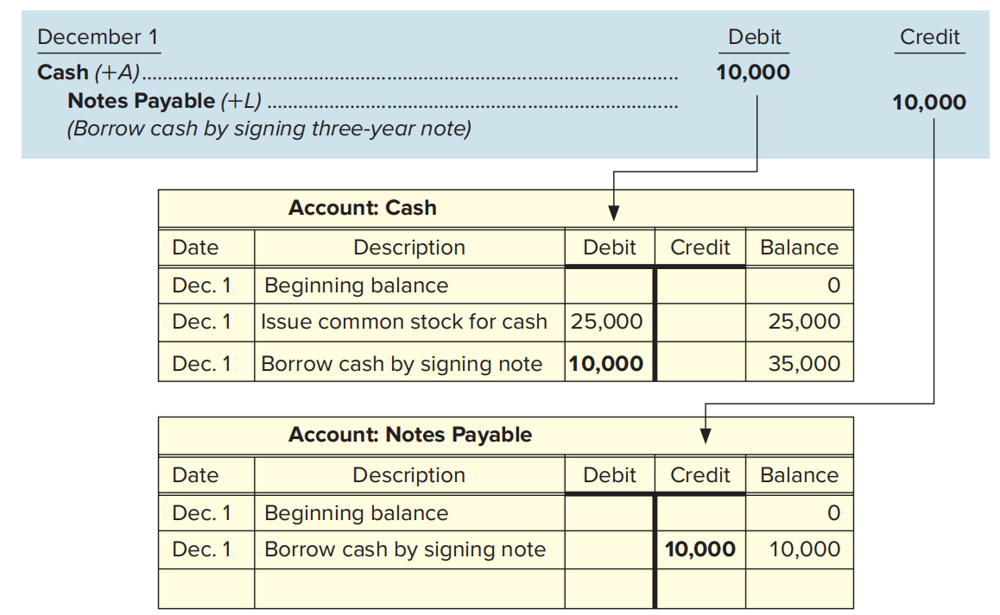

# Ch2 会计循环（期中）

## Part A MEASURING BUSINESS ACTIVITIES

### 2.1.1 External Transactions

外部交易（External Transactions）是指与其他公司之间的业务往来。

**Account（账户）**: Summary of all transactions related to a particular item over a period of time.

- **Asset accounts**: Cash, Supplies (物料), and Equipment

- **Liability accounts**: Accounts Payable (应付账款), Salaries Payable, Utilities Payable, and Taxes Payable (应交税金)

- **Stockholders’ equity accounts**: Common Stock (普通股) and Retained Earnings (留存收益)

衡量外部交易的6个步骤：

Step 1 Use source documents to identify accounts affected by an external transaction.
Step 2 Analyze the impact of the transaction on the accounting equation.
Step 3 Assess whether the transaction results in a debit or credit to account balances.
Step 4 Record the transaction in a journal using debits and credits.
Step 5 Post the transaction to the general ledger.
Step 6 Prepare a trial balance.

### 2.1.2 Effects of Transactions on the Basic Accounting Equation（第2步）

以 Eagle Soccer Academy 为例，这是一家足球培训学院，它有如下外部交易：

### 2.1.3 Effects of Transactions on the Expanded Accounting Equation（第2步） 

扩展的会计恒等式（图2-3）：

其中，Revenues-Expenses=Net Income，即 收入-费用=利润。

交易（6）-（10）会影响扩展的会计恒等式。

## Part B DEBITS AND CREDITS

### 2.2.1 Effects on Account Balances in the Basic Accounting Equation（第3步）

### 2.2.2 Effects on Account Balances in the Expanded Accounting Equation（第3步）

扩展后的会计恒等式涉及到6个账户，即上图中蓝色区域的3个和橙色区域的3个，它们的借贷方向可通过下图进行简单记忆：

In accounting terminology, debit means left, and credit means right. Let‘s split **DEALOR** into its left and right side. The three accounts on the left, or debit, side of **DEALOR**—**D**ividends, **E**xpenses, and **A**ssets—increase with a debit and decrease with a credit. In contrast, the three accounts on the right, or credit, side—**L**iabilities, **O**wners’ (stockholders’) equity, and **R**evenues—increase with a credit and decrease with a debit.

### 2.2.3 Recording Transactions in a Journal（第4步）

journal 是日记账，journal entry 是会计分录（或者称为日记账分录），entry是“条目、分录”的意思。

会计分录的格式如下：

### 2.2.4 Posting to the General Ledger（第5步）

**Posting（过账）**: process of transferring the debit and credit information from the journal to individual accounts in the general ledger.

**General ledger（总账/总分类账）**: includes all accounts used to record the company’s transactions. 总账包含多个账户，每个账户记录属于这个账户的每笔交易。总账的一个账户格式如下：

把交易（1）从日记账过到总账：

把交易（2）从日记账过到总账：

为了简便起见，下面我们将使用 T型账户（**T-account**: a simplified form of a general ledger account） 展示过账的过程。

例如，过完交易（2）之后的总账可以写成如下形式：

把交易（3）从日记账过到总账：

### 2.2.5 Trial Balance（第6步）

试算平衡表相当于是正式发布的财务报表的一个草稿，用于验算借方余额是否等于贷方余额。

## 附录：术语表

| 英文               | 中文                                            | 解释                                                         |
| ------------------ | ----------------------------------------------- | ------------------------------------------------------------ |
| journal            | 日记账                                          |                                                              |
| journal entry      | 会计分录/日记账分录， entry是“条目、分录”的意思 |                                                              |
| trial balance      | 试算平衡表                                      |                                                              |
| Subsidiary Ledgers | 明细分类账                                      | 是总分类账(General Ledger)的补充详细记录 提供某个控制账户(control account)的详细信息 最常见的两种明细分类账是：  应收账款明细分类账(Accounts Receivable Subsidiary Ledger)：记录每个客户的应收款明细 应付账款明细分类账(Accounts Payable Subsidiary Ledger)：记录对每个供应商的应付款明细 |
| General Ledger     | 总账/总分类账                                   |                                                              |

