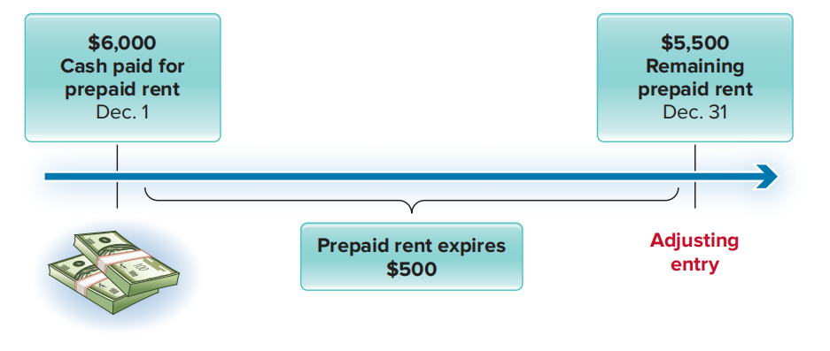
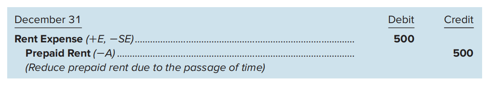

# Ch3 会计循环（期末）

## Part A

### 3.1.1 Accrual-Basis Accounting

权责发生制 / 应计制：凡是本期已经实现的收入和已经发生或应当负担的费用，不论其款项是否已经收付，都应作为当期的收入和费用处理；凡是不属于当期的收入和费用，即使款项已经在当期收付，都不应作为当期的收入和费用。

Revenue recognition 

- Revenues are recorded in the period in which the goods or services are provided to customers

- **Revenue recognition principle (收入确认原则)**

Expense recognition

- Any costs used to help generate revenues are recorded as expenses in the same period as those revenues.

- Commonly referred to as the **matching principle（配比原则）**

Most expenses are recorded in the same period as the revenues they help to generate. Other expenses indirectly related to producing revenues are recorded in the period they occur. **直接费用与收入进行直接配比来确定本期损益**；其他费用则通过判断而采用适当合理的标准

### 3.1.2 Accrual-Basis Compared with Cash-Basis Accounting

收付实现制以收到/支付现金的时间为准：

- We record revenues at the time we *receive cash.*

- We record expenses at the time we *pay cash.*

权责发生制更好，它是GAAP（Generally Accepted Accounting Principles）的一部分，而收付实现制不是。

The difference between accrual-basis accounting and cash basis accounting is timing. Under accrual-basis accounting, we record revenues when we provide goods and services to customers, and we record expenses with the revenue they help to generate. Under cash-basis accounting, we record revenues when we receive cash, and we record expenses when we pay cash. Cash-basis accounting is not allowed for financial reporting purposes for most major companies. 两者时间点不同

### 3.1.3 Adjusting Entries

调整分录，为每个会计期间的利润表确定恰当的收入和费用金额

Adjusting entries are a necessary part of accrual-basis accounting. They are used to record changes in assets and liabilities (and their related revenues and expenses) that have occurred during the period but have not yet been recorded by the end of the period.

The timing differences that create the need for adjusting entries can be grouped into two broad categories—*prepayments* and *accruals.* 

**Prepayments **

- involve cash flows occurring **before** the revenues and expenses are recognized.
- 两种情况：预付费用（属于资产）和递延收益（属于负债）
  - **Prepaid Expenses**—Pay cash (or have an obligation to pay cash) to purchase an asset in the current period that will be recorded as an expense in a future period. 
  - **Deferred Revenues**—Receive cash in the current period that will be recorded as a revenue in a future period.
- 例如，在2020年年初，A公司预付了一年的房租，记为资产，到了2020年末，这些预付的房租已经被用完了，因此需要在资产中减去。

**Accruals**

- opposite of prepayments. 

- involve cash flows occurring **after** the revenues and expenses are recognized.
- 两种情况
  - **Accrued Expenses**—Record an expense in the current period that will be paid in cash in a future period.应计费用
  - **Accrued Revenues**—Record a revenue in the current period that will be collected in cash in a future period.应计收入

下面继续以 Eagle Soccer Academy 为例说明调整分录的具体做法。

#### (1) PREPAID EXPENSES

预付费用先借记为资产，在未来贷记资产（-A），并将资产费用化（+E，-SE）

**a) 预付房租**

**b) Supplies**

#### (2) DEFERRED REVENUES

递延收益（或者叫预收账款，属于负债，先收现金，未来提供服务，比如充值会员卡，只有在提供服务之后，才能把负债转记成收入）

第一步 （收到现金）：借记现金（+A），贷记债务（+L）

第二步 （供服务后调整）：借记债务（-L），贷记收入（+R，+SE)

#### (3) Accrued Expenses

**Accrued expenses** are recorded when a company has a cost that is used to help produce revenue but hasn’t yet paid cash for that cost. 已用来产生收入，但还没有支付现金的费用。

应计费用的调整分录：借记费用（+E，-SE），贷记负债（+L）。

Prepayments 是以前有一笔老账，现在需要再记一笔进行更新，而 Accruals 是未来会有一笔帐，但要把它提前到现在进行记录，通常用于现金支付在下一个会计周期，而现在需要编制财务报表的时候。两者是不同的。

#### (4) 

应计收入：比如客户以赊账的方式购买了产品或服务。借记资产（+A），贷记收入（+R，+SE）

### 3.1.4 Adjusted Trial Balance

## Part B THE REPORTING PROCESS: FINANCIAL STATEMENTS

### 3.2.1 利润表

### 3.2.2 所有者权益变动表

## Part C THE CLOSING PROCESS

### 3.3.1 Closing Entries

好的，直接翻译这段文字：

所有出现在资产负债表中的账户，包括留存收益在内，都是永久性账户。这意味着我们要将它们的余额从一个期间结转到下一个期间。例如，如果现金（一项资产）或应付账款（一项负债）在年末的余额是 \$1,000，那么这也将是下一年年初的余额。然而，临时性账户——收入、费用和股利账户 则不是这样。对于这些账户，我们在年末将每个账户的余额转入一个账户——留存收益，然后所有收入、费用和股利账户在下一年年初都从 \$0 余额开始。我们通过结账分录来完成从临时账户到留存收益的余额转移。

结账分录(Closing Entries)：结账分录是将所有临时账户（revenues, expenses, and dividends）的余额转入留存收益账户的过程。也就是把留存收益的三个分项转入到留存收益账户。留存收益账户是永久性账户

