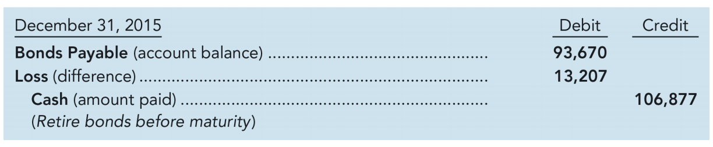

# Ch9 长期负债

## Part A TYPES OF LONG-TERM DEBT

### 9.1.1 Financing Alternatives

资本结构：股权融资和债券融资的比例

### 9.1.2 Installment Notes（分期付款票据）

您可能买过汽车，甚至房子。如果没有支付现金，您就需要签署一份票据，承诺在一定期限内支付购买价格，比如汽车4年，房子30年。汽车贷款和房屋贷款通常要求按月分期付款，而不是在到期时一次性支付。公司也经常使用分期付款票据借款。每次分期付款都包括利息部分和减少未偿还贷款余额的部分。定期减少的余额足以确保在到期时票据完全还清。

举例说明，假设California Coasters公司于2021年11月1日获得了一笔25,000美元、6%利率、四年期的贷款（即发行了一张票据，从投资者那里借钱），用于购买一辆新的送货卡车。要求在48个月内每月月底支付587.13美元。摊销表以表格形式详细列出了每期的现金支付、每笔现金支付中代表利息和账面价值变动的部分，以及账面价值的余额。对于分期付款应付票据，利息部分记为利息费用，账面价值则是贷款的剩余余额。图表9-1提供了部分摊销表。完整的摊销表应该包含48次付款的每一行。我们用星号表示省略的期间。

分期付款票据的摊销表：

Notice the following features of the amortization schedule:

1. **Date.** Payments are made at the end of each month.
2. **Cash Paid.** Monthly payments remain the same over the loan period.
3. **Interest Expense.** Interest expense equals the prior month’s carrying value times the interest rate (in this example, the monthly interest rate is 0.5% = 6% annual rate × 1/12).

4. **Decrease in Carrying Value.** The cash paid in excess of interest expense reduces the carrying value (remaining loan balance). 每期还的钱-其中的利息部分=贷款余额的减少值

5. **Carrying Value.** The carrying value begins at \$25,000, the original amount of the loan. With each monthly cash payment, the portion assigned to interest expense becomes less and the portion that reduces the carrying value becomes more. By the end of the four-year loan, the \$25,000 loan has been paid off and the carrying value equals \$0. carrying value 即还没还清的钱（贷款余额）， 表示负债的多少，支付的现金比利息费用多，则carrying value下降，反之上升

### 9.1.3 Leases（租赁）

### 9.1.4 Bonds（债券）

| 债券特征          | 中文名       | 解释                           |
| ----------------- | ------------ | ------------------------------ |
| Secured bonds     | 资产担保债券 | 有抵押品（collateral）作为担保 |
| Unsecured bonds   | 无担保债券   |                                |
| Term bonds        | 定期债券     | 在单一到期日                   |
| Serial bonds      | 系列债券     | 分期到期                       |
| Callable bonds    | 可赎回债券   | 发行公司可提前赎回             |
| Convertible bonds | 可转换债券   | 可转换为普通股                 |

Example. Assume that on January 1, 2021, California Coasters decides to raise money for development of its new roller coaster by issuing $100,000 of bonds paying interest of 7% each year. The bonds are due in 10 years, with interest payable semiannually on June 30 and December 31 each year. **In practice, most corporate bonds pay interest semiannually (every six months) rather than paying interest monthly, quarterly, or annually.** Thus, investors in California Coasters’ bonds will receive:

1. **Face amount** of $100,000 at the end of 10 years, plus

2. **Interest payments** of \$3,500 (= \$100,000 × 7% × 1/2 year) every six months for 10 years. That’s a total of 20 interest payments of \$3,500 each (= \$70,000). 

Illustration 9–5 provides a timeline of the cash flows related to the bond issue.

图9-5: 债券现金流

## Part B ACCOUNTING FOR BONDS PAYABLE

To see how to record the issuance of bonds and the related interest, let’s return to our initial example. On January 1, 2021, California Coasters issues $100,000 of 7% bonds, due in 10 years, with interest payable semiannually on June 30 and December 31 each year.

### 9.2.1 按面值发行（票面利率等于市场利率）

stated interest rate（票面利率）：The **stated interest rate** is the rate specified in the bond contract used to calculate the cash payments for interest.

2021年1月1日（发行日）：借记Cash，贷记Bonds Payable

2021年6月30日（第一个半年）：借记expense，贷记Cash

以此类推，每过半年就会记一下。

Default risk: 违约风险

在其他条件相同的情况下，投资者会对违约风险较高的债券要求更高的市场利率。违约风险是指公司可能无法在到期时支付债券面值或利息的可能性。随着债券的违约风险增加，投资者可以通过在发行日支付较低的价格来提高债券存续期间的收益率。

### 9.2.2 低于面值发行（票面利率低于市场利率）

让我们假设California Coasters公司发行相同金额的10万美元、7%票面利率的债券，但由于公司的违约风险较高，投资者要求8%的市场收益率。California Coasters的债券对投资者的吸引力较低，因为他们每年获得的票面利率为7%，低于他们要求的8%的收益率。由于这个不利的利率差异，投资者支付的价格将低于10万美元来购买这些债券。这些债券将以93,205美元的折价发行。

（下图来自于课件，摘自第3版教材，第5版教材对此做了些微调整，但是感觉不如第3版简洁）

2015年1月1日（发行日）：借记Cash，贷记Bonds Payable

2015年6月30日（第一个半年）：借记expense，贷记Cash和 Bonds Payable。相当于公司支付的利息（Cash，实际支付给投资者的钱）比实际要偿还的利息（Interest Expense，代表投资者通过市场利率能获得的收益）少，因此负债增加（即carrying value上升，直到最后与Face Amount 相等,）。

2015年12月31日（第二个半年）：借记expense，贷记Cash和 Bonds Payable。注意此时由于carrying value提高，利息费用相应提高

摊销表（ carrying value 就相当于负债余额，支付的现金比利息费用多，则carrying value下降，反之上升，比如这里就是上升）：

### 9.2.3 高于面值发行（票面利率高于市场利率）

原理和低于面值发行一样，只需把Bonds Payable的方向改一下。相当于公司支付的利息（Cash，实际支付给投资者的钱）比实际要偿还的利息（Interest Expense，代表投资者通过市场利率能获得的收益）多，因此负债减少（即carrying value下降，直到最后与Face Amount 相等）。

摊销表：

综合以上3种情况，我们可以总结出债券carrying value随时间的变化：

### 9.2.4 Retirement of Bonds

When the issuing company buys back its bonds from the investors, we say the company has *retired* those bonds. The company can wait until the bonds mature to retire them, or frequently (for reasons we describe below), the issuing company will choose to buy the bonds back from the investors early.

(1) 在债券到期时

Regardless of whether bonds are issued at face amount, at a discount, or at a premium, **their carrying value at maturity will equal their face amount.**

(2) 提前

**Early extinguishment of debt**: retirement of debt before its scheduled maturity

RC Enterprises公司在类似风险的债券收益率为8%时，发行了面值10万美元、票面利率7%、期限10年的债券。这些债券于2015年1月1日以低于面值的价格（折价）93,205美元发行。2015年期间，市场利率从8%下降到6%，RC Enterprises决定在发行一年后的2015年12月31日赎回这些债券，此时债券的账面价值为93,670美元。

如果市场利率不变（还是8%），这个债券的carrying value（carring value其实就是用未来现金流算出来的债券的现值）是93670美元，即公司只需要花费93670美元就能把这个债券买回来，但是市场利率下降（从8%变成了6%），此时债券的市场价值就变成了106877美元，因此公司要再多花13207美元把这个债券买回来，借记expense，表示损失（Loss）

为什么要提前回购债务？

在上面的例子中，由于市场利率下降1%，California Coasters记录了7,476美元的损失。公司可以通过包含赎回条款来保护自己免受利率下降的影响，该条款允许公司以固定价格（比如面值加2%，在我们的例子中就是102,000美元）回购债券。当利率下降时，具有赎回条款的公司更可能回购成本较高的债务，然后以新的、更低的利率重新发行债务。这种回购和重新发行的方式可以降低未来的利息支出。

提前偿还债务的另一个原因是改善公司的债务比率（将在本章后面讨论）。Six Flags以略高于3亿美元的价格出售了七个游乐园，并用这些收益来减少其总体债务。

提前清偿债务的时机选择也可以用来管理报告盈利。由于应付债券是按账面价值而非市场价值报告的，公司可以通过选择债券回购的时机来帮助达到预期收益。例如，当利率上升时，债券价格下跌。在这种情况下，California Coasters在提前清偿时将记录收益而不是损失。

## Part C PRICING A BOND

未来现金流用市场利率折现

## Part D 负债分析

Debt to Equity Ratio（负债权益比率）是一个衡量公司财务杠杆和财务风险的重要指标。

Return on Assets (ROA，资产收益率）是衡量公司资产使用效率和盈利能力的重要指标。

Times Interest Earned Ratio（利息保障倍数）是一个重要的财务比率，用来衡量公司支付利息的能力。**the higher a company’s earnings relative to its interest expense, the more likely it will be able to make current and future interest payments.**

## 附录：术语表

| 英文                     | 中文             | 解释                                                         |
| ------------------------ | ---------------- | ------------------------------------------------------------ |
| Installment Notes        | 分期付款票据     |                                                              |
| amortization schedule    | 摊销表           | 摊销表是一个用于展示贷款或资产折旧的分期付款安排的文档。它列出了每期的还款金额、利息、本金和剩余余额，通常用于房贷、汽车贷款等贷款类型的计算。 |
| outstanding loan balance | 未偿还的贷款余额 |                                                              |
| indenture                | 合约，合同       |                                                              |
|                          |                  |                                                              |
|                          |                  |                                                              |
|                          |                  |                                                              |
|                          |                  |                                                              |
|                          |                  |                                                              |

