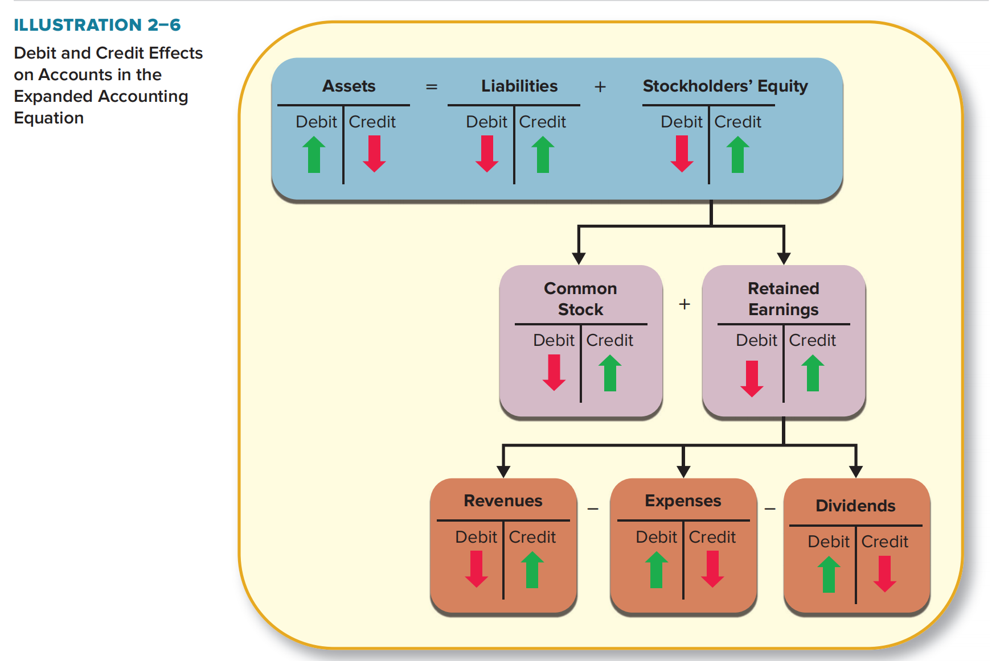
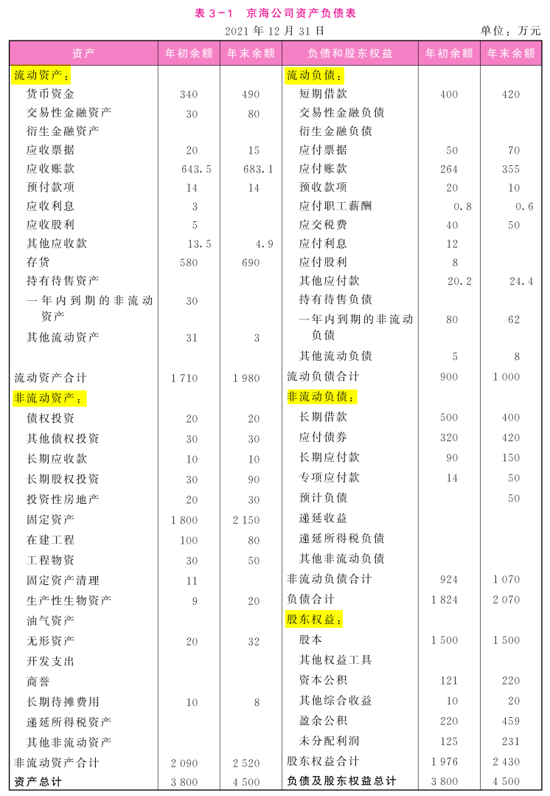
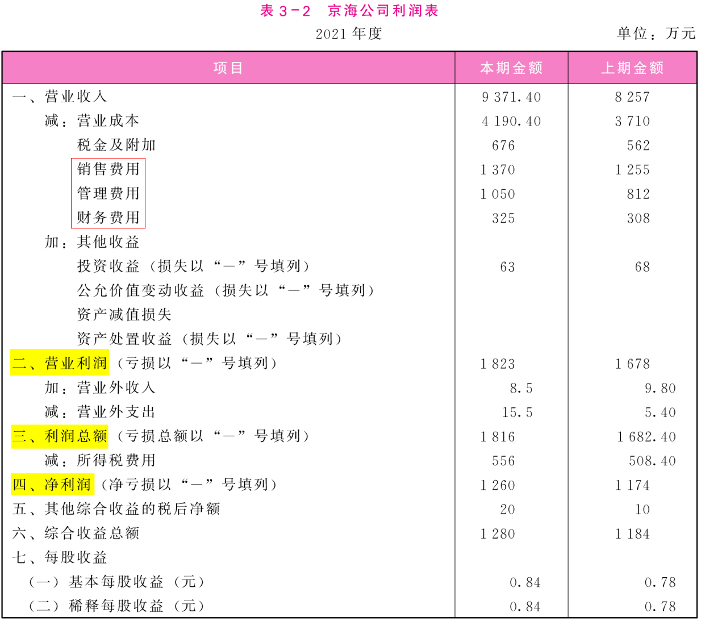
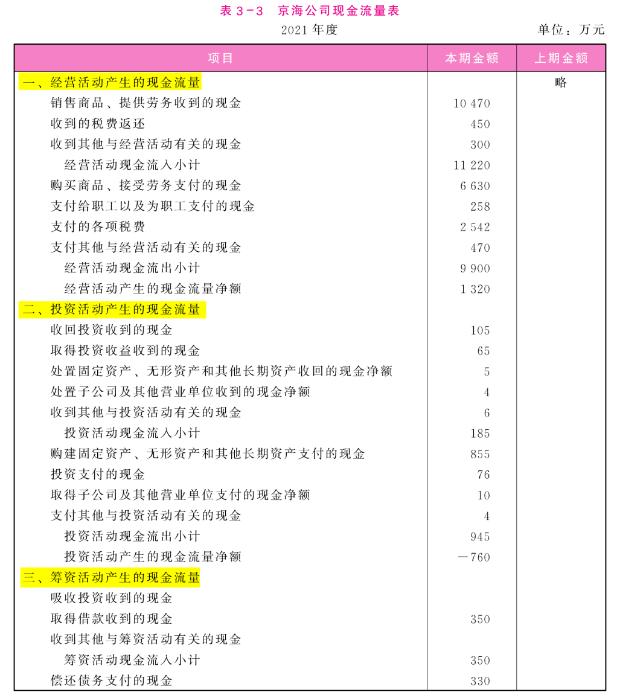
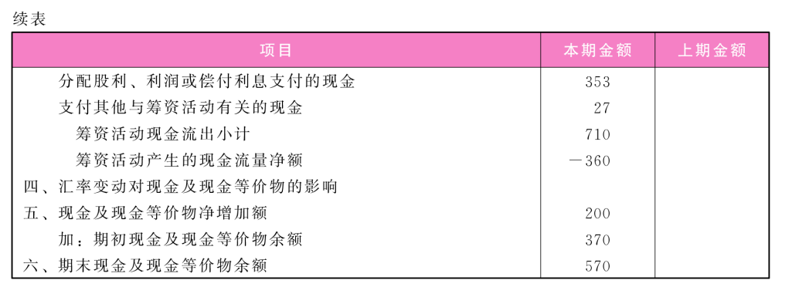

## 一、会计学基础

## 二、财务分析（教材第3章）

### （一）偿债能力

#### 1. 短期偿债能力

短期偿债能力是指企业偿付流动负债的能力。流动负债是将在1年内或超过1年的一个营业周期内需要偿付的债务，这部分负债对企业的财务风险影响较大，如果不能及时偿还，就可能使企业陷入财务困境，面临破产倒闭的危险。在资产负债表中，流动负债与流动资产形成一种对应关系。一般来说，流动负债需要以现金直接偿还，而流动资产是在1年内或超过1年的一个营业周期内可变现的资产，因而流动资产就成为偿还流动负债的一个安全保障。因此，可以通过分析流动负债与流动资产之间的关系来判断企业短期偿债能力。通常评价短期偿债能力的财务比率主要有流动比率、速动比率、现金比率、现金流量比率等。

（1）流动比率(liquidity ratio or current ratio)。流动比率是企业流动资产与流动负债的比值。其计算公式为：
$$
流动比率=\frac{流动资产}{流动负债} \tag{3-1}
$$
流动资产主要包括货币资金、以公允价值计量且其变动计入当期损益的金融资产、应收及预付款项、存货和1年内到期的非流动资产等，一般用资产负债表中的期末流动资产总额表示；流动负债主要包括短期借款、以公允价值计量且其变动计入当期损益的金融负债、应付及预收款项、各种应交税费、1年内到期的非流动负债等，通常也用资产负债表中的期末流动负债总额表示。根据表3-1中京海公司的流动资产和流动负债的年末数，该公司2021年末的流动比率为：
$$
流动比率= \frac{1980}{1000}=1.98
$$
这表明京海公司每有1元的流动负债，就有1.98元的流动资产作为安全保障。流动比率是衡量企业短期偿债能力的一个重要财务指标，这个比率越高，说明企业偿还流动负债的能力越强，流动负债得到偿还的保障越大。但是，过高的流动比率也并非好现象，因为流动比率过高，可能是企业滞留在流动资产上的资金过多，未能有效地加以利用，可能会影响企业的盈利能力。

根据西方的经验，流动比率在2左右比较合适，京海公司的流动比率为1.98，应属于正常范围。实际上，对流动比率的分析应该结合不同的行业特点、流动资产结构及各项流动资产的实际变现能力等因素。有的行业流动比率较高，有的行业较低，不可一概而论。但是，单凭这种经验判断并不可靠，有时流动比率较高，但其短期偿债能力未必很强，因为可能是存货积压或滞销的结果，而且企业很容易伪造这个比率，以掩饰其偿债能力的不足。如果年终时故意将借款还清，下年初再借入，就可以人为地提高期末流动比率。假设某一公司拥有流动资产20万元、流动负债10万元，则流动比率为2；如果该公司在年终编制财务报表时，故意还清5万元短期借款，待下年初再借入，则该公司的流动资产就变成了15万元，流动负债变成了5万元，流动比率为3。这样就提高了期末流动比率，粉饰了短期偿债能力。因此，利用流动比率来评价企业短期偿债能力存在一定的局限性。

（2）速动比率(quick ratio or acid-test ratio)。从前面的分析可知，流动比率在评价企业短期偿债能力时，存在一定局限性。如果流动比率较高，但流动资产的流动性较差，则企业的短期偿债能力仍然不强。在流动资产中，以公允价值计量且其变动计入当期损益的金融资产、衍生金融资产、应收票据、应收账款的变现能力均比存货强，存货需经过销售才能转变为现金，如果存货滞销，则其变现就成问题，所以**存货是流动资产中流动性相对较差的资产。一般来说，流动资产扣除存货后的资产称为速动资产**，主要包括货币资金、以公允价值计量且其变动计入当期损益的金融资产、衍生金融资产、应收票据、应收账款等。速动资产与流动负债的比值称为速动比率。其计算公式为：
$$
速动比率= \frac{速动资产}{流动负债}= \frac{流动资产—存货}{流动负债} \tag{3-2}
$$
通过速动比率来判断企业短期偿债能力比用流动比率更进了一步，因为它撇开了变现能力较差的存货。速动比率越高，说明企业的短期偿债能力越强。根据表3-1中的有关数据，京海公司2021年末的速动比率为：
$$
速动比率= \frac{1980-690}{1000}=1.29
$$
根据西方经验，一般认为速动比率为1时比较合适，京海公司的速动比率为1.29，应属于正常范围之内。但在实际分析时，应该根据企业性质和其他因素来综合判断，不可一概而论。通常影响速动比率可信度的重要因素是应收账款的变现能力，如果企业的应收账款中有较大部分不易收回，可能会成为坏账，那么速动比率就不能真实反映企业的偿债能力。因此，在使用速动比率分析企业短期偿债能力时，应结合应收账款账龄结构进行分析。

需要说明的是，用流动资产扣除存货来计算速动资产只是一种粗略的计算，严格地讲，不仅要扣除存货，还应扣除预付账款、1年内到期的非流动资产和其他流动资产等变现能力较差的项目。这样，速动资产就只包括货币资金、以公允价值计量且其变动计入当期损益的金融资产、应收票据、应收账款、应收利息、应收股利和其他应收款。

（3）现金比率(cash ratio)。现金比率是企业的现金类资产与流动负债的比值。现金类资产包括库存现金、随时可用于支付的存款和现金等价物，即现金流量表中所反映的现金及现金等价物。其计算公式为：
$$
现金比率= \frac{现金+现金等价物}{流动负债} \tag{3-3}
$$
根据表3-1中京海公司的有关数据（假定该公司以公允价值计量且其变动计入当期损益的金融资产均为现金等价物），该公司2021年末的现金比率为（**分子来自于资产负债表”货币资金“”交易性金融资产“”衍生金融资产“的年末余额，其实也等于现金流量表最下面的”六、期末现金及现金等价物余额“**）：
$$
现金比率= \frac{490+80}{1000}=0.57
$$
现金比率可以反映企业的直接偿付能力，因为现金是企业偿还债务的最终手段，如果企业现金缺乏，就可能发生支付困难，面临财务危机。因此，现金比率高，说明企业有较好的支付能力，偿付债务是有保障的。但是如果这个比率过高，可能意味着企业拥有过多的盈利能力较低的现金类资产，企业的资产未能得到有效运用。

（4）现金流量比率(cash flow ratio)。现金流量比率是企业经营活动产生的现金流量净额与流动负债的比值。其计算公式为：
$$
现金流量比率= \frac{经营活动产生的现金流量净额}{流动负债} \tag{3-4}
$$
前面介绍的流动比率、速动比率和现金比率都是反映企业短期偿债能力的静态指标，揭示了企业的现存资源对偿还到期债务的保障程度。现金流量比率则是从动态角度反映本期经营活动产生的现金流量净额偿付流动负债的能力。根据表3-1和表3-3中的有关数据，京海公司2021年的现金流量比率为：
$$
现金流量比率= \frac{1320}{1000} =1.32
$$
需要说明的是，**经营活动产生的现金流量是过去一个会计年度的经营结果，而流动负债则是未来一个会计年度需要偿还的债务，二者的会计期间不同**。因此，这个指标是建立在以过去一年的现金流量来估计未来一年的现金流量的假设基础之上的。使用这一财务比率时，需要考虑未来一个会计年度影响经营活动的现金流量变动的因素。

#### 2.长期偿债能力分析

长期偿债能力是指企业偿还长期负债的能力，企业的长期负债主要有长期借款、应付债券、长期应付款、专项应付款、预计负债等。企业的长期债权人和所有者不仅关心企业短期偿债能力，更关心企业长期偿债能力。因此，在对企业进行短期偿债能力分析的同时，还需分析企业的长期偿债能力，以便于债权人和投资者全面了解企业的偿债能力及财务风险。反映企业长期偿债能力的财务比率主要有：资产负债率、股东权益比率、权益乘数、产权比率、有形净值债务率、偿债保障比率、利息保障倍数和现金利息保障倍数等。

（1）资产负债率(total debt ratio)。资产负债率也称负债比率或举债经营比率，是企业负债总额与资产总额的比率，它反映企业的资产总额中有多大比例是通过举债得到的。其计算公式为：
$$
资产负债率= \frac{负债总额}{资产总额} \times 100\% \tag{3-5}
$$
资产负债率反映企业偿还债务的综合能力，这个比率越高，企业偿还债务的能力越差，财务风险越大；反之，偿还债务的能力越强。根据表3-1中的有关数据，京海公司2021年末的资产负债率为：
$$
资产负债率= \frac{2070}{4500} \times 100\% = 46\%
$$
这表明2021年京海公司的资产有46%源于举债；或者说，京海公司每46元的债务，就有100元的资产作为偿还债务的保障。

对于资产负债率，企业的债权人、股东和管理者往往从不同的角度来评价。

从债权人角度来看，他们最关心的是其贷给企业资金的安全性。如果这个比率过高，说明在企业的全部资产中，股东提供的资本所占比重太低，企业的财务风险主要由债权人负担，其贷款的安全性缺乏可靠的保障，所以，债权人总是希望企业的负债比率低一些。

从企业股东的角度来看，他们关心的主要是投资报酬的高低。企业借入的资金与股东投入的资金在生产经营中可以发挥同样的作用，如果企业负债所支付的利率低于资产报酬率，股东就可以利用举债经营取得更多的投资报酬。因此，股东所关心的往往是全部资产报酬率是否超过了借款的利率。企业股东可以通过举债经营的方式，以有限的资本、付出有限的代价取得对企业的控制权，并且得到举债经营的杠杆利益。**因此在财务分析中，资产负债率也被称为财务杠杆比率。**

站在企业管理者的立场，他们既要考虑企业的盈利，也要顾及企业所承担的财务风险。资产负债率作为财务杠杆比率，不仅反映了企业的长期财务状况，也反映了企业管理层的进取精神。如果企业不利用举债经营或者负债比率很小，则说明企业管理者比较保守，对前途信心不足，利用债权人资本进行经营活动的能力较差。但是，负债也必须有一定限度，负债比率过高，企业的财务风险将增大，一旦资产负债率超过100%则说明企业资不抵债，有濒临倒闭的危险。

至于资产负债率为多少才是合理的，并没有一个确定的标准。不同行业、不同类型的企业资产负债率会存在较大差异。一般而言，处于高速成长时期的企业，其资产负债率可能会高一些，这样，所有者会得到更多的杠杆利益。但是，作为财务管理者，在确定企业的资产负债率时一定要审时度势，充分考虑企业内部各种因素和企业外部的市场环境，在风险与报酬之间权衡利弊与得失，才能作出正确的财务决策。

（2）股东权益比率（也叫净资产比率）与权益乘数。股东权益比率是股东权益总额（也即所有者权益总额）与资产总额的比率，该比率反映资产总额中有多大比例是所有者投入的。其计算公式为：
$$
股东权益比率= \frac{股东权益总额}{资产总额} \times 100\% \tag{3-6}
$$
由式(3-6)可知，股东权益比率与资产负债率之和等于1。因此，这两个比率是从不同的侧面反映企业长期财务状况，股东权益比率越大，资产负债率就越小，企业的财务风险也越小，偿还长期债务的能力就越强。根据表3-1中的有关数据，京海公司2021年末的股东权益比率为：
$$
股东权益比率= \frac{2430}{4500} \times 100\%=54\%
$$
**股东权益比率的倒数称为权益乘数，即资产总额是股东权益总额的多少倍。**权益乘数反映了企业财务杠杆的大小。权益乘数越大，说明股东投入的资本在资产中所占比重越小，财务杠杆越大。其计算公式为：
$$
权益乘数= \frac{资产总额}{股东权益总额} \tag{3-7}
$$
根据表3-1中的有关数据，京海公司2021年末的权益乘数为：
$$
权益乘数=\frac{4500}{2430}=1.85
$$
也可以用资产平均总额除以股东权益平均总额计算平均权益乘数，2021年京海公司的平均权益乘数为：
$$
平均权益乘数= \frac{(3800+4500)/2}{(1976+2430)/2} =1.8838
$$
（3）产权比率与有形净值债务率。产权比率，也称负债股权比率，是负债总额与股东权益总额的比值。其计算公式为：
$$
产权比率= \frac{负债总额}{股东权益总额} \tag{3-8}
$$
从式(3-8)可以看出，产权比率实际上是负债比率的另一种表现形式，它反映了债权人所提供资金与股东所提供资金的对比关系，因此可以揭示企业的财务风险以及股东权益对债务的保障程度。该比率越低，说明企业长期财务状况越好，债权人贷款的安全性越有保障，企业财务风险越小。根据表3-1中的有关数据，京海公司2021年末的产权比率为：
$$
产权比率= \frac{2070}{2430}=0.85
$$
为了进一步分析股东权益对负债的保障程度，可以保守地认为无形资产不宜用来偿还债务(虽然实际上未必如此), 故将其从上式的分母中扣除，这样计算出的财务比率称为有形净值债务率。其计算公式为：
$$
有形净值债务率= \frac{负债总额}{股东权益总额一无形资产净值} \tag{3-9}
$$
从式(3-9)可以看出，有形净值债务率实际上是产权比率的延伸，它更为保守地反映了在企业清算时债权人投入的资本受到股东权益的保障程度。该比率越低，说明企业的财务风险越小。根据表3-1中的有关数据，京海公司2021年末的有形净值债务率为：
$$
有形净值债务率= \frac{2070}{2430-32}=0.86
$$
（4）偿债保障比率。偿债保障比率也称债务偿还期，是负债总额与经营活动产生的现金流量净额的比值。其计算公式为：
$$
偿债保障比率= \frac{负债总额}{经营活动产生的现金流量净额} \tag{3-10}
$$
从式(3-10)可以看出，偿债保障比率反映了用企业经营活动产生的现金流量净额偿还全部债务所需的时间，所以该比率也被称为债务偿还期。一般认为，经营活动产生的现金流量是企业长期资金的最主要来源，而投资活动和筹资活动所获得的现金流量虽然在必要时也可用于偿还债务，但不能将其视为经常性的现金流量。因此，用偿债保障比率可以衡量企业通过经营活动所获得的现金偿还债务的能力。该比率越低，说明企业偿还债务的能力越强。根据表3-1和表3-3中的有关数据，京海公司2021年的偿债保障比率为：
$$
偿债保障比率= \frac{2070}{1320}=1.57
$$
（5）利息保障倍数(times interest earned ratio,TIE)与现金利息保障倍数。利息保障倍数也称利息所得倍数或已获利息倍数，是税前利润加利息费用之和与利息费用的比值。其计算公式为：
$$
利息保障倍数= \frac{税前利润+利息费用}{利息费用} \tag{3-11}
$$
根据表3-2中的有关数据（假定京海公司的财务费用都是利息费用，并且固定资产成本中不含资本化利息），京海公司2021年的利息保障倍数为：
$$
利息保障倍数= \frac{1816+325}{325}=6.59
$$
式(3-11)中的税前利润是指缴纳所得税之前的利润总额；利息费用不仅包括财务费用中的利息费用，还包括计入固定资产成本的资本化利息。利息保障倍数反映了企业的经营所得支付债务利息的能力。如果这个比率太低，说明企业难以保证用经营所得来按时按量支付债务利息，这会引起债权人的担心。一般来说，企业的利息保障倍数至少要大于1,否则难以偿付债务及利息，长此以往甚至会导致企业破产倒闭。

但是，在利用利息保障倍数这一指标时必须注意，会计采用权责发生制来核算费用，所以本期的利息费用不一定就是本期的实际利息支出，而本期发生的实际利息支出也并非全部是本期的利息费用；同时，本期的息税前利润也并非本期的经营活动所获得的现金。这样，利用上述财务指标来衡量经营所得支付债务利息的能力就存在一定的片面性，不能清楚地反映实际支付利息的能力。为此，可以进一步用现金利息保障倍数来分析经营所得现金偿付利息支出的能力。其计算公式为：
$$
现金利息保障倍数=\frac{经营活动产生的现金流量净额+现金利息支出+付现所得税}{现金利息支出 } \tag{3-12}
$$
式(3-12)中的现金利息支出是指本期用现金支付的利息费用；付现所得税是指本期用现金支付的所得税。由式(3-12)可知，现金利息保障倍数反映了企业一定时期经营活动所取得的现金是现金利息支出的多少倍，它更明确地表明了企业用经营活动所取得的现金偿付债务利息的能力。根据表3-2和表3-3中的有关数据(假设京海公司财务费用都是现金利息支出，并且所得税费用也都是付现所得税),京海公司2021年的现金利息保障倍数为：
$$
现金利息保障倍数=\frac{1320+325+556}{325}=6.77
$$
至于以上两个财务比率究竟是多少才说明企业偿付利息的能力强，并没有一个确定的标准，通常要根据历年的经验和行业特点来判断。

### （二）营运能力

1. 应收账款周转率

应收账款周转率(receivables turnover ratio)是企业一定时期赊销收入净额与应收账款平均余额的比率。**企业的赊销收入，是指企业已经发出商品，确认收入，结转了成本，但是还未收到货款的一种状态。**应收账款周转率是评价应收账款流动性大小的一个重要财务比率，它反映了应收账款在一个会计年度内的周转次数，可以用来分析应收账款的变现速度和管理效率。该比率越高，说明应收账款的周转速度越快、流动性越强。其计算公式为：
$$
应收账款周转率= \frac{赊销收入净额 }{应收账款平均余额} \\
应收账款平均余额= \frac{期初应收账款+期末应收账款}{2}
$$
式(3-13)中的赊销收入净额是指销售收入净额扣除现销收入之后的余额；销售收入净额是指销售收入扣除销售退回、销售折扣及折让后的余额。在利润表中，营业收入就是销售收入。在这里，我们假设京海公司的营业收入全部都是赊销收入净额，根据表3-1和表3-2中的有关数据，京海公司2021年的应收账款周转率为：
$$
应收账款平均余额= \frac{643.5+683.1}{2} =663.3(万元) \\
应收账款周转率= \frac{9371.4}{663.3}=14.13(次)
$$
在市场经济条件下，由于商业信用的普遍应用，应收账款成为企业一项重要的流动资产，应收账款的变现能力直接影响资产的流动性。应收账款周转率越高，说明企业收回应收账款的速度越快，可以减少坏账损失，提高资产的流动性，企业的短期偿债能力也会得到增强，这在一定程度上可以弥补流动比率低的不利影响。如果企业的应收账款周转率过低，则说明企业收回应收账款的效率低，或者信用政策过于宽松，这样的情况会导致应收账款占用资金数量过多，影响企业资金利用率和资金的正常周转。应收账款周转率过高，也可能是因为企业奉行了比较严格的信用政策，制定的信用标准和信用条件过于苛刻。这样会限制企业销售量的扩大，从而影响企业的盈利水平，这种情况往往表现为存货周转率同时偏低。

用应收账款周转率来反映应收账款的周转情况是比较常见的，如上面计算的京海公司应收账款周转率为14.13次，表明该公司一年内应收账款周转次数为14.13次（**相当于把应收账款卖出了14.13次**）。也可以用应收账款平均收账期来反映应收账款的周转情况。其计算公式为：
$$
应收账款平均收账期= \frac{360}{应收账款周转率}
$$
应收账款平均收账期表示应收账款周转一次所需的天数。平均收账期越短，说明企业的应收账款周转速度越快。根据京海公司的应收账款周转率，计算出的应收账款平均收账期为：
$$
应收账款平均收账期= \frac{360}{14.13}=25.48(天)
$$
京海公司的应收账款平均收账期为25.48天，说明京海公司从赊销产品到收回应收账款的平均天数为25.48天。应收账款平均收账期与应收账款周转率成反比例变动，对该项指标的分析是企业制定信用政策的一个重要依据。

2. 存货周转率

存货周转率(inventory turnover ratio)也称存货利用率，是企业一定时期的销售成本与存货平均余额的比率。其计算公式为：
$$
存货周转率=\frac{销售成本}{存货平均余额} \\
存货平均余额= \frac{期初存货余额+期末存货余额}{2}
$$
式(3-16)中的销售成本可以从利润表中得知，假设营业成本全部为销售成本，存货平均余额是期初存货余额与期末存货余额的平均数，可以根据资产负债表计算得出。如果企业生产经营活动具有很强的季节性，则年度内各季度的销售成本与存货会有较大幅度的波动。因此，存货平均余额应该按月份或季度余额来计算，先计算出各月或各季度的存货平均余额，然后再计算全年的存货平均余额。

3. 流动资产周转率

流动资产周转率(liquid assets turnover ratio)是销售收入与流动资产平均余额的比率，它反映了企业全部流动资产的利用效率。其计算公式为：
$$
流动资产周转率=\frac{销售收入}{流动资产平均余额} \\
流动资产平均余额=\frac{期初流动资产余额+期末流动资产余额}{2}
$$
流动资产周转率表明在一个会计年度内企业流动资产周转的次数，它反映了流动资产周转的速度。该指标越高，说明企业流动资产的利用效率越高

### （三）盈利能力

1. 资产回报率ROA (Return on Assets)
$$
ROA=\frac{净利润}{总资产}
$$

2. 净资产收益率ROE (return on equity）
$$
ROE= \frac{净利润}{所有者权益}=\frac{净利润}{总资产} \times \frac{总资产}{净资产}=\text{资产回报率} \times \text{权益乘数}
$$

3. 销售毛利率与销售净利率

(1)销售毛利率。销售毛利率也称毛利率，是企业的销售毛利与营业收入净额的比率。其计算公式为：
$$
\text{销售毛利率} = \frac{营业收入净额-营业成本}{营业收入净额} \qquad (3-31)
$$
式(3-31)中的销售毛利是企业营业收入净额与营业成本的差额，可以根据利润表计算得出。营业收入净额是指营业收入扣除销售退回、销售折扣与折让后的净额。销售毛利率反映了企业的营业成本与营业收入的比例关系，销售毛利率越大，说明在营业收入净额中营业成本所占比重越小，企业通过销售获取利润的能力越强。根据表3-2中的有关数据，京海公司2021年的销售毛利率为：

销售毛利率= 9371.4—4190.4 ×100?5.29% 9371.4

京海公司2021年的销售毛利率为55.29说明每100元的营业收入可以为公司创造55.29元的毛利。

(2)销售净利率。销售净利率(profit margin on sales)是企业净利润与营业收入净额的比率，其计算公式为：
$$
\text{销售净利率} = \frac{净利润}{营业收入净额} \qquad (3-32)
$$

5.每股利润与每股现金流量

(1) 每股收益（EPS）。也称每股盈余，是公司普通股每股所获得的净利润，它是股份公司税后利润分析的一个重要指标。每股利润等于净利润扣除优先股股利后的余额，除以发行在外的普通股平均股数。其计算公式为：
$$
\text{EPS} = \frac{净利润-优先股股利}{普通股股数} \qquad (3-31)
$$
8. 市盈率和市净率

以下三个都是低比较好

(1) 市盈率 (price/earnings ratio,P/E) 也称价格盈余比率或价格与收益比率，是指普通股每股股价与每股利润的比率。其计算公式为：
$$
\text{市盈率} = \frac{每股价格}{每股收益} = \frac{总市值}{净利润 }
$$
(2) 市净率 (price/book-value ratio,P/B) ，是指普通股每股股价与每股净资产的比率。其计算公式为：
$$
\text{市净率} = \frac{每股价格}{每股净资产} = \frac{总市值}{净资产 }
$$
(3) 市销率

市销率 = 每股价格/每股收入 = 总市值/总收入

简称P/S，Price to Sales

以上三个都是低比较好

### （四）发展能力

## 三、财务科目详解

1. 合营、联营和关联方

合营企业，企业与其他合营方一同对被投资单位实施共同控制的企业。联营企业，企业对被投资单位具有重大影响的企业。

投资者对联营企业具有重大影响，即对被投资企业的经营决策和财务决策只具有参与决策的权利，而不具有控制权。合营者对投资企业的经营决策和财务决策具有控制权，而不是重大影响，这种控制权是共同控制。

投资者对于两者参与决策权的类型有所不同，投资者对联营企业的经营决策和财务决策具有参与决策权，而不具有控制权;投资者对合营企业的经营决策和财务决策具有共同控制权。

根据《企业会计准则第36号——关联方披露》的规定：**一方控制、共同控制另一方或对另一方施加重大影响，以及两方或两方以上同受一方控制、共同控制或重大影响的，构成关联方。**

**下列各方构成企业的关联方：**

（1）该企业的母公司。

（2）该企业的子公司。

（3）与该企业受同一母公司控制的其他企业。

（4）对该企业实施共同控制的投资方。

（5）对该企业施加重大影响的投资方。

（6）该企业的合营企业。

（7）该企业的联营企业。

（8）该企业的主要投资者个人及与其关系密切的家庭成员。主要投资者个人，是指能够控制、共同控制一个企业或者对一个企业施加重大影响的个人投资者。

（9）该企业或其母公司的关键管理人员及与其关系密切的家庭成员。关键管理人员，是指有权力并负责计划、指挥和控制企业活动的人员。与主要投资者个人或关键管理人员关系密切的家庭成员，是指在处理与企业的交易时可能影响该个人或受该个人影响的家庭成员。

（10）该企业主要投资者个人、关键管理人员或与其关系密切的家庭成员控制、共同控制或施加重大影响的其他企业。

2. 信用减值损失、资产减值损失、坏账准备

## 四、技术指标
